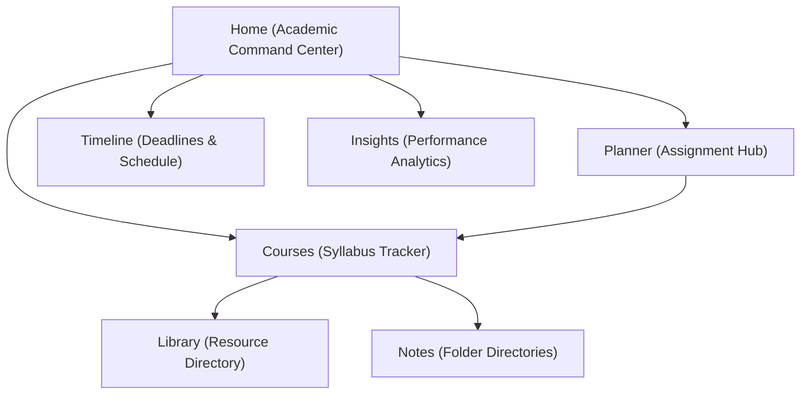

# SemesterOS: Product Definition Document
**Category:** Academic Operating System (AOS)  
**Author:** Product & UX Strategy Lead  
**Status:** Draft / Strategic Alignment  

---

## 1. Vision & Mission

### The Vision
To transform the chaotic, anxiety-inducing student experience into a calm, structured, and predictable journey. We envision a world where academic success is not a byproduct of high-stress cramming, but a result of systematic, incremental progress facilitated by a software environment that acts as an extension of the student's own mind.

### The Mission
SemesterOS is an **Academic Operating System** designed to reduce academic anxiety. It aims to eliminate cognitive overhead and "syllabus blindness" by providing students with absolute clarity on:
*   **What to study** (algorithmic prioritization based on deadlines, difficulty, and progress).
*   **What is due** (unified timeline of assignments, exams, and project milestones).
*   **How much progress they've made** (transparent syllabus completion metrics).
*   **What needs attention next** (preventive alerts to catch issues before they turn into emergencies).

---

## 2. Target Users & Personas

Our target users are university/college students balancing modular semesters, multiple courses, lab practicals, and shifting deadlines. We categorize them into two key personas:

### Persona A: "The Overwhelmed sophomore" (Hemanth, 20)
*   **Profile:** Second-year Computer Science major. Taking 5 technical courses, 2 labs, and an aptitude course.
*   **Context:** Constantly feels behind. Balances lectures, lab reviews, coding assignments, and self-study.
*   **Behaviors:** Uses a mix of sticky notes, WhatsApp groups for deadlines, and Google Calendar (which he forgets to check). Often discovers an assignment is due only 24 hours beforehand.
*   **Pain Points:** High academic anxiety. "Syllabus blindness"—he looks at the 60-page curriculum PDF once at the start of the semester and never again. He has no idea how much of the syllabus he has actually covered.
*   **Core Need:** A centralized command center that tells him exactly what to do *today* to avoid failing or cramming.

### Persona B: "The Strategic High-Achiever" (Ananya, 21)
*   **Profile:** Third-year Bio-Engineering student aiming for graduate school.
*   **Context:** Highly organized but highly stressed. Wants to optimize her study blocks, maintain a 3.9+ GPA, and track attendance to prevent condonation issues.
*   **Behaviors:** Extensively tracks study hours, plans modules weeks in advance, maintains a digital library of reading materials.
*   **Pain Points:** Spends too much time *managing* her productivity systems (Notion databases, TickTick sub-tasks) instead of actual studying. Stressed about attendance margins and syllabus weight.
*   **Core Need:** A zero-maintenance dashboard that calculates her academic standing automatically and optimizes her study velocity.

---

## 3. User Problems

1.  **Academic Anxiety (Cognitive Load):** Students waste mental energy wondering, *“What should I work on right now?”* The constant fear of forgetting a deadline creates a background hum of stress.
2.  **Syllabus Blindness:** Course curriculums are locked in static PDFs or outdated LMS platforms (Canvas/Blackboard). Students don’t track their progress through the actual modular units of a course; they only track assignments.
3.  **The Attendance Trap:** Many universities enforce strict attendance thresholds (e.g., 75%). Students struggle to keep track of their buffer sessions, leading to last-minute panic or disqualification.
4.  **Fragmented Workspaces:** Deadlines are in the LMS, lecture notes are in notebooks or Google Docs, schedules are on calendar apps, and tasks are on scrap paper. The context-switching tax is high.

---

## 4. Product Goals

*   **Reduce Time-to-Decide to Zero:** When a student opens SemesterOS, the "Next Study recommendation" must tell them immediately what topic to focus on, eliminating decision paralysis.
*   **Syllabus-Centric Tracking:** Shift the student's perspective from "finishing tasks" to "mastering modules."
*   **Proactive Condonation Prevention:** Keep attendance tracking front-and-center, turning it into a gamified safety margin.
*   **Frictionless Cognitive Offloading:** Make adding assignments, scheduling study sessions, and attaching resources take less than three clicks.

---

## 5. Success Metrics

To measure if SemesterOS is achieving its mission of reducing anxiety and structuring semesters:

| Metric Category | Metric Definition | Proxy for |
| :--- | :--- | :--- |
| **Anxiety Reduction** | Overdue Planner Item Rate (Ratio of overdue items to total items) | Decreasing rate indicates proactive study habits and timely completion. |
| **Cognitive Friction** | Time spent on the app per day (Goal: < 5 mins) | We want students *using* the app to direct their life, not living *in* the app tweaking layouts. |
| **Academic Momentum** | Study Session Streak (Consecutive days with logged study sessions) | Gamified retention and consistent daily study habits. |
| **Syllabus Progress** | Average Course Completion Rate per month | Health of the academic term; steady progress vs. end-of-term spikes. |
| **Safety Margins** | Average Attendance Margin above 75% | Peace of mind regarding academic regulations. |

---

## 6. Core Features (The OS Metaphor)

SemesterOS is structured like a product-led operating system, with highly integrated components working together:



### A. Home (Academic Command Center)
*   **Syllabus Recommendation Engine:** An algorithmic component that scores incomplete course topics based on proximity of deadlines, module weight, difficulty, and current study gaps, outputting the single best topic to study *now*.
*   **Workload Scorecard:** Dynamically calculates a student's weekly workload index (Balanced ➔ Overloaded) based on hours of study required for upcoming deadlines.
*   **Smart Notifications:** Context-aware micro-alerts (e.g., *"No study sessions logged for Additive Manufacturing in 5 days"* or *"Attendance in COA is at 76%—next class is critical"*).

### B. Planner
*   **Academic Item Manager:** A high-fidelity planner built specifically for school tasks (Theory prep, Lab reports, Quiz notes).
*   **Priority & Mark Weighting:** Allows tasks to be prioritized not just by date, but by grade weight (e.g., a midterm project vs. a daily quiz).

### C. Courses
*   **Modular Syllabus Tracker:** Visual breakdown of each course into structured Modules and Topics. Students mark progress at the topic level, feeding the global syllabus progress ring.
*   **Attendance Buffer Calculator:** Simple counter showing attendance percentage, total classes attended/conducted, and how many classes can be safely missed before falling below the 75% threshold.
*   **Embedded Workspace (Notes & Library):** Standard markdown note scratchpad and resource link directory mapped to each course.

### D. Timeline
*   **Dual Agenda Grid:** Displays academic events (lectures, exams) alongside planner items (deadlines) in a unified chronological layout to visualizes day-to-day density.

### E. Insights
*   **Academic Analytics:** Tracks cumulative metrics including syllabus coverage, attendance safety indexes, average study block durations, and streak counts.

---

## 7. Non-goals

To maintain a laser focus on academic anxiety reduction, SemesterOS explicitly avoids:
*   **Social & Collaboration Tools:** No chat, no shared study rooms, no classmate directories. SemesterOS is a private, distraction-free environment for the individual student.
*   **Rich Text Document Editor:** SemesterOS provides quick scratchpads for class notes, but it does not try to compete with Google Docs, Obsidian, or Word. It is a metadata manager, not an authoring environment.
*   **General Project Management:** No Kanban boards for personal life, budgeting, or job applications. If it is not on the syllabus, it does not belong in the core system.
*   **Learning Management System (LMS):** SemesterOS does not host tests, grade submissions, or lecture videos. It sits *on top* of the LMS as a student-first navigation layer.

---

## 8. Design Principles

Our frontend architecture and user interface are guided by four core product-design principles:

### 1. Clarity Over Decoration
Clean typography (Inter), high-contrast elements, and generous negative space. Avoid unnecessary decorations, neon borders, or cyberpunk grids that increase visual noise. A student looking at the UI must feel their heart rate *decrease*.

### 2. Performance as a UX Feature
Instant page routing, sub-100ms interactions, and immediate state persistence. If the student experiences lag while trying to log a task, they will abandon the OS and return to paper.

### 3. Adaptive Semantics
Design tokens scale naturally across devices (mobile-first layout for checking schedules on the way to class, desktop layout for deep study sessions). Color tokens are functional, not decorative (e.g., Orange for "In Progress", Teal for "Completed", Rose for "Urgent").

### 4. Calm Motion
All transitions must feel natural and physical. Use spring physics (`framer-motion`) with exponential ease-out curves under 300ms. If a student is already anxious, jittery or flashing animations will exacerbate cognitive fatigue.

---

## 9. The Emotional Experience

SemesterOS is designed around an emotional lifecycle:

```
[Student enters in state of Panic/Chaos]
                  │
                  ▼
         [Step 1: Offloading]
(Quick Add Planner items / Set attendance)
                  │
                  ▼
      [Step 2: Command Overview]
(Recommendation Engine tells them what to study next)
                  │
                  ▼
         [Step 3: Actionable Focus]
(Deep study session with clear visual progress)
                  │
                  ▼
        [Step 4: Relief/Calm]
(Visual reassurance of safety margins and streaks)
```

We transition the user through three distinct emotional states:
1.  **Control:** By offloading syllabus schedules and deadlines into a system that remembers them perfectly.
2.  **Predictability:** Knowing that the recommendation engine is mathematically directing their focus to what matters most.
3.  **Reassurance:** Visible progress trackers (Syllabus progress bars, Attendance buffers) show they are safe from academic penalties.

---

## 10. Competitive Analysis

How does SemesterOS stack up against general-purpose tools when applied to the student use case?

| Feature / Dimension | Notion | TickTick / Todoist | Google / Apple Calendar | SemesterOS (Academic OS) |
| :--- | :--- | :--- | :--- | :--- |
| **System Philosophy** | Blank canvas database manager. | Micro-task lists. | Chronological time blocks. | Pre-structured Academic Operating System. |
| **Syllabus Awareness** | Manual setup. Must build databases, relations, and progress formulas from scratch. | None. Just a flat list of tasks. | None. Calendar events are isolated blocks. | **Native.** The syllabus (modules/topics) is the foundation. Tasks link directly to syllabus topics. |
| **What to Study Next?** | User must manually filter databases or choose themselves. | User must filter by due date/tags and make a manual choice. | Only shows what is scheduled, not what needs cognitive preparation. | **Algorithmic.** Dynamic engine computes priorities and recommends the exact topic to study. |
| **Attendance Buffer** | Requires custom mathematical formula columns in databases. | No native tracking. | No native tracking. | **Native.** Attendance trackers calculate safety buffers and trigger warning states automatically. |
| **Setup Cost** | Extremely high (hours of template design). Leads to "productivity procrastination." | Low, but requires constant maintenance. | Low, but disconnected from tasks and coursework content. | **Zero.** Pre-seeded with modular courses, ready to track immediately. |
| **Cognitive Load** | High. Easy to get lost in styling, widgets, and nesting databases. | Medium. Long backlogs of overdue tasks create guilt and anxiety. | Medium. A packed calendar creates calendar anxiety without actionable guidance. | **Low.** Designed specifically to reduce anxiety via clear recommendations and safety buffers. |

---

## 11. Frontend Architecture Guidelines

As Frontend Architects, our codebase must reflect this product strategy:
*   **Deterministic State Engine:** The core mathematical algorithms (e.g., `recalculateSubject`, streak calculation, workload scoring) must live in a centralized, easily testable store (`stores/AcademicEngine`). State must never be duplicated in local page states.
*   **Strict Component Separation:** UI primitives (buttons, inputs, dialogs) must be kept strictly decoupled from domain-specific features (Courses, Planner, Timeline).
*   **Accessibility First:** Support semantic markup, keyboard focus outlines, ARIA attributes for screen readers, and respect the browser's `prefers-reduced-motion` settings. A system meant to reduce anxiety must not isolate users with accessibility needs.
